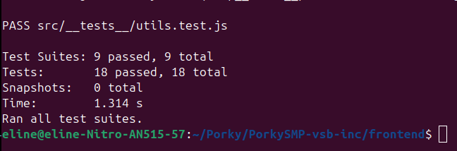
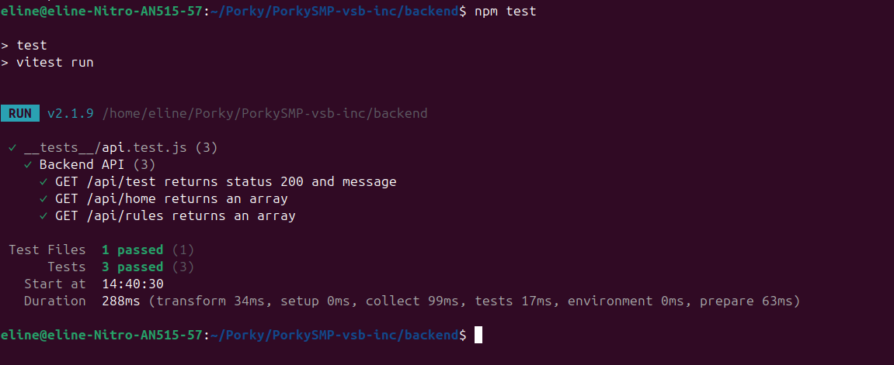

#  Testresultaten rapport - PorkySMP

## Teststatistieken

| Categorie | Waarde |
|-----------|--------|
| **Totaal Tests** | 21 |
| **Geslaagd** | ✅ 21 |
| **Gefaald** |  0 |
| **Slagingspercentage** |  100% |
| **Frontend Tests** | 9 bestanden |
| **Backend Tests** | 1 bestand |


## Screenshots

### Frontend tests


### Backend tests


---


##  Gedetailleerde testresultaten

### 1.  Homepage tests

| Test | Status | Beschrijving |
|------|--------|--------------|
| Loading state | ✅ | Toont "Loading content…" tijdens het laden van data |
| Error state | ✅ | Toont "Failed to load content." bij foutmelding |
| Title & Rules link | ✅ | Rendert "Porky SMP" titel en link naar rules pagina correct |

---

### 2.  Carousel tests

| Test | Status | Beschrijving |
|------|--------|--------------|
| Dots rendering | ✅ | Dots renderen correct met actieve indicator (bg-pink-600) |
| Next/Previous buttons | ✅ | Navigatie knoppen wijzigen slide index correct en cyclen door slides |

**Gevalideerde functionaliteit:**
-  Dot indicator update bij klik
-  Next knop verhoogt slide index
-  Previous knop verlaagt slide index
-  Correcte slide cycling

---

### 3.  Access control tests

| Test | Status | Beschrijving |
|------|--------|--------------|
| Authenticated rendering | ✅ | Toont beschermde content voor ingelogde gebruikers |
| Unauthenticated redirect | ✅ | Redirect naar `/auth` voor niet-ingelogde gebruikers werkt correct |

---

### 4.  Input component tests

| Test | Status | Beschrijving |
|------|--------|--------------|
| URL normalization | ✅ | Voegt automatisch `https://` protocol toe aan URL's on blur |
| Favicon preview | ✅ | Toont favicon preview met Google favicon service na debounce |

**Gevalideerde functionaliteit:**
-  onChange wordt correct aangeroepen met genormaliseerde URL
-  Google favicon service URL constructie
-  Debounce functionaliteit

---

### 5.  UI component tests

| Test | Status | Beschrijving |
|------|--------|--------------|
| Destructive variant | ✅ | Button met destructive variant krijgt `bg-red-500` klasse |
| Size large | ✅ | Button met large size krijgt `h-11` klasse |

---

### 6.  Utility function tests

| Test | Status | Beschrijving |
|------|--------|--------------|
| `cn()` class joining | ✅ | Filtert falsy waarden en voegt truthy classnames samen |
| `getFaviconUrl()` | ✅ | Construeert correcte Google favicon service URL met domain parameter |

---

### 7.  Data fetching hook tests (useHome)

| Test | Status | Beschrijving |
|------|--------|--------------|
| Successful fetch | ✅ | Loading state management en data wordt correct ingesteld |
| Error handling | ✅ | Error state wordt correct afgehandeld bij mislukken |

**Loading State Flow:**
```
loading: true → fetch → loading: false
```

---

### 8.  Data fetching hook tests (useRules)

| Test | Status | Beschrijving |
|------|--------|--------------|
| Successful fetch | ✅ | Loading state management en RulesContent wordt correct ingesteld |
| Error handling | ✅ | Error state wordt correct afgehandeld bij mislukken |

**Loading State Flow:**
```
loading: true → fetch → loading: false
```

---

### 9.  Markdown component tests

| Test | Status | Beschrijving |
|------|--------|--------------|
| Markdown rendering | ✅ | Rendert markdown headings correct als h1 elementen |

---

### 10.  Backend API tests

| Endpoint | Status | Response Code | Beschrijving |
|----------|--------|---------------|--------------|
| `GET /api/test` | ✅ | 200 | Retourneert message: "Backend is working!" |
| `GET /api/home` | ✅ | 200 | Retourneert JSON array met home content |
| `GET /api/rules` | ✅ | 200 | Retourneert JSON array met rules content |

---

##  Conclusie

Alle 21 tests zijn **succesvol** uitgevoerd. De PorkySMP-applicatie functioneert correct op alle geteste gebieden:

- ✅ **Frontend Componenten** - Alle UI componenten renderen en reageren correct
- ✅ **Data Management** - Hooks en API calls werken foutloos
- ✅ **Toegangscontrole** - Authenticatie en autorisatie functioneren correct
- ✅ **Backend API** - Alle endpoints retourneren verwachte responses

